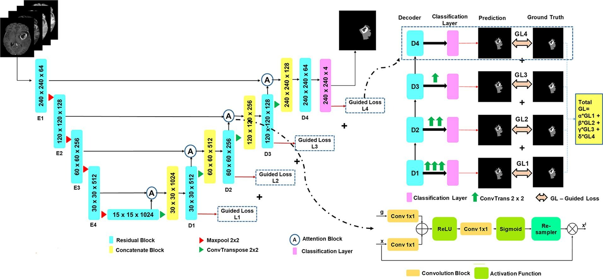
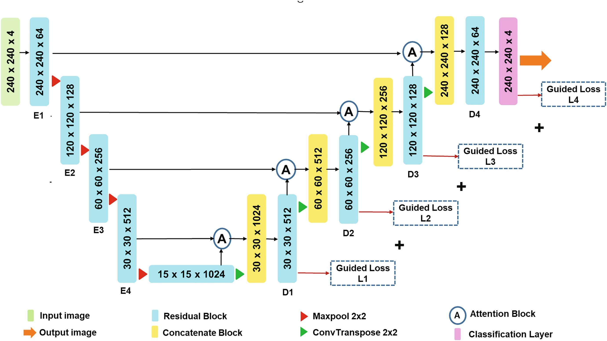
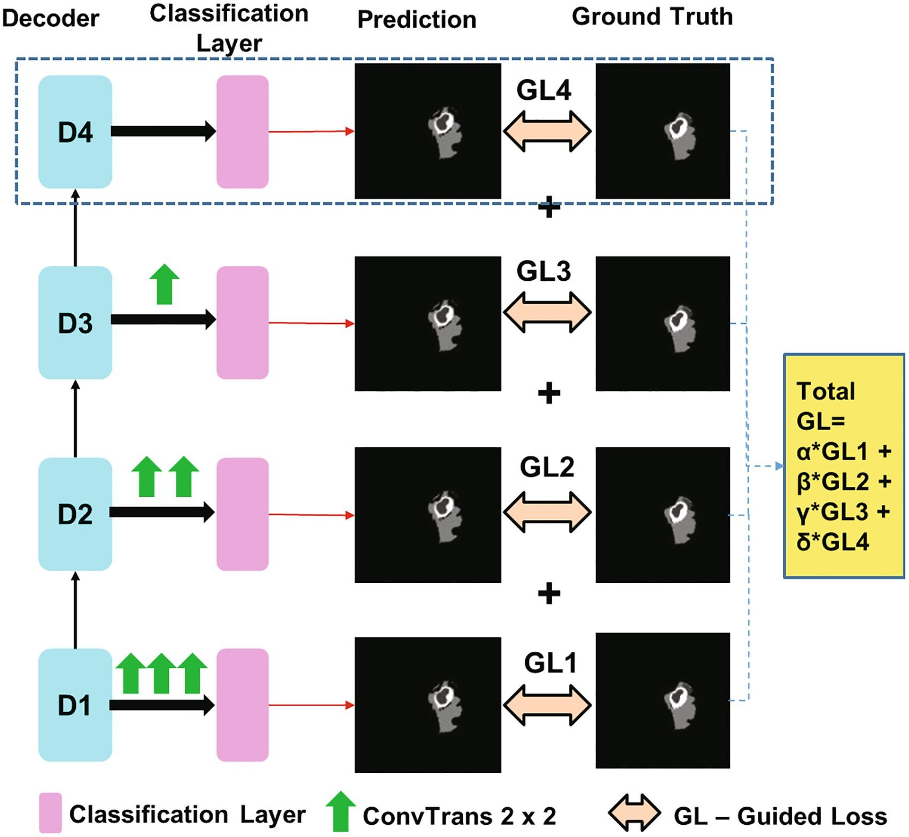

## Attention Res-UNet with Guided Decoder for semantic segmentation of brain tumors

### Graphical Abstract

The automatic segmentation of brain tumors in Magnetic Resonance Imaging (MRI) plays a major role in accurate diagnosis and treatment planning. The present study proposes a new deep learning generator architecture called Attention Res-UNet with Guided Decoder (ARU-GD) for the segmentation of brain tumors. The proposed generator architecture have the capability to explicitly guide the learning process of each decoder layer. The individual loss function to each decoder layer helps to supervise the learning process of each layer in the decoder and thereby enables them to generate better feature maps. The attention gates in the generator focuses on the activation of relevant information instead of allowing all information to pass through the skip connections in the Res-UNet. Our model performed well in comparison to the baseline models i.e. UNet, Res-UNet, and Res-UNet with attention gates. The proposed ARU-GD is compared with popular deep learning models VGG-Net, MobileNet, QuickNAT, DenseNet and XceptionNet, and BraTS 2019 leaderboard models. The proposed ARU-GD has achieved Dice Scores of 0.911, 0.876 and 0.801 and mean IoU of 0.838, 0.781 and 0.668 on the whole tumor, tumor core and enhancing tumor respectively on unseen High-Grade Glioma test data.

### Architecture

### Guided Decoder Loss

### Ablation study

### Comparative study

Cite this paper: 

Dhiraj Maji, Prarthana Sigedar, Munendra Singh, Attention Res-UNet with Guided Decoder for semantic segmentation of brain tumors, Biomedical Signal Processing and Control, Volume 71, Part A, 2022, 103077, ISSN 1746-8094 https://doi.org/10.1016/j.bspc.2021.103077
